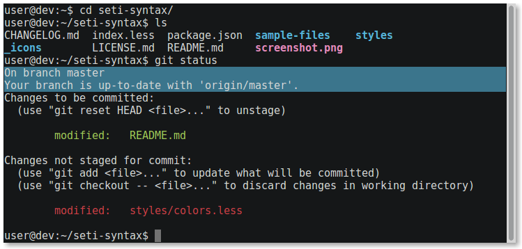

# Seti UI Color Scheme for Xfce4 Terminal

Color scheme made for the **xfce4-terminal**, using colors from [seti-ui] and
[seti-syntax] by [jesseweed].

## Installation

Just add the contents of `terminalrc` to `~/.config/xfce4/terminal/terminalrc`.

If you do not have that file, the best way to do that is probably by copying it
directly from this repo:

    mkdir -p ~/.config/xfce4/terminal # make sure the directory exists
    curl https://raw.githubusercontent.com/felipedau/xfce4-terminal-seti-ui-colors/master/terminalrc -o ~/.config/xfce4/terminal/terminalrc

**Note:** For earlier versions, the `terminalrc` file might be at
`~/.config/Terminal`.

[jesseweed]: https://github.com/jesseweed
[seti-ui]: https://github.com/jesseweed/seti-ui
[seti-syntax]: https://github.com/jesseweed/seti-syntax
